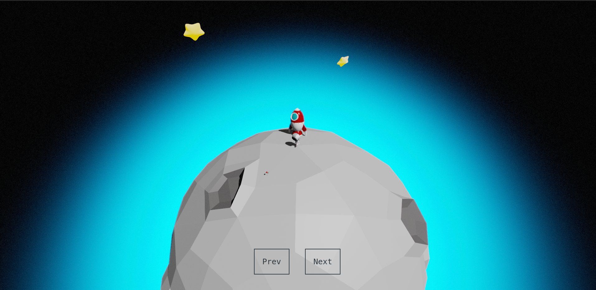

# Basic working scene

## How to run

Using node version 18.19.1

```bash
npm install
```

```bash
npm run dev
```

## Featuring:

- Resize
- Request animation frame render
- Statsjs
- Orbit controls (optionals)
- Basic lighting
- Model loading
- Basic shadows
- Basic postprocessing (noise, bloom)
- Camera interactivity
- Custom game object abstractions
- Animations
- Slider between scene objects
- Camera speed based chromatic aberration



## TODO

- [ ] Add motion blur
- [ ] Add abstraction for mouse and keys input
- [ ] Move camera following planet orbit
